### Мета заняття
Додамо ще деталей через **Geometry Nodes**

### Виконання

1. Потрібно додати додаткових посипок зверху на наш бублик. Для цього ми повинні спочатку змістити **Cursor**. Переміщення відбувається через **[Shift+Left Mouse]**. Виставимо його десь збоку.

    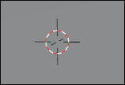

    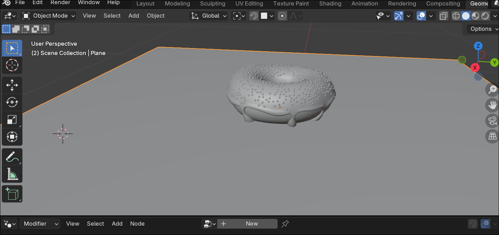

1. Додаємо циліндр - **[Shift+A]** -> Mesh -> Cylinder. Характеристики обрати якомога менші

    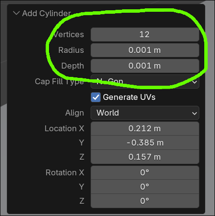

1. Піднімемо об'єкт трохи по Z осі - **[G]** + **[Z]**

1. Розтягнемо наш об'єкт по Z - **[S]** + **[Z]**
    
    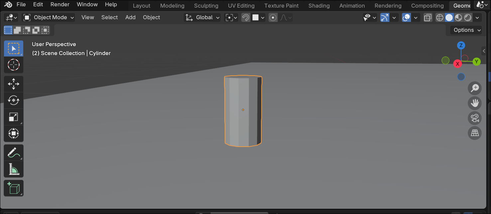

1. Тепер перемкнемо режим обирання частинок на грані

    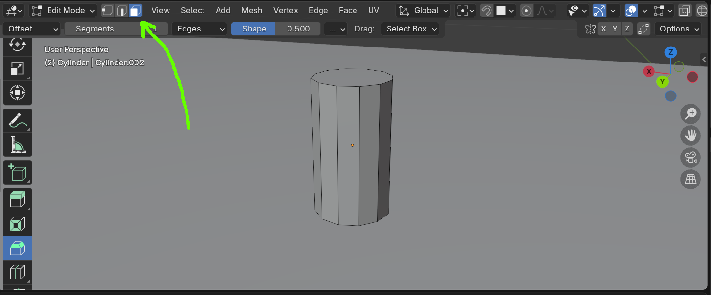

1. Виділимо дві грані: та що зверху та ту що знизу

    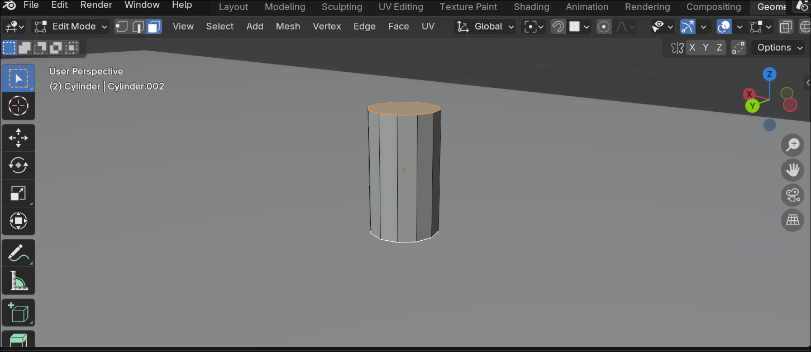

1. Додамо Bevel -> **[Ctrl + B]**, коли ви рухаєте мишкою ви управляєте кутом, колесико миші управляє кількістю зрізів. Трьох зрізів буде достатньо.

    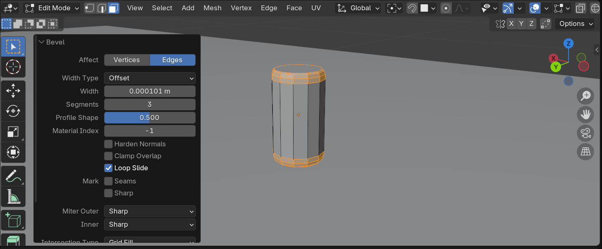

1. Здублікуємо об'єкт декілька разів **[Ctrl+D]**

    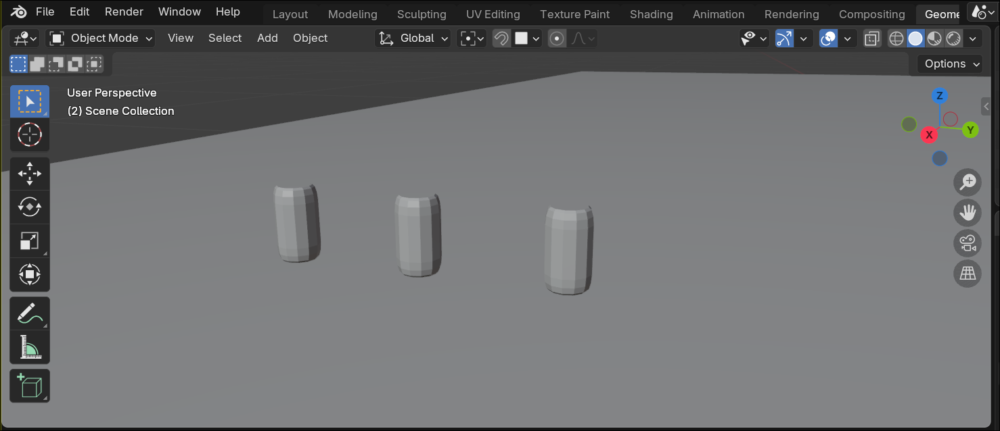

1. Розтягнемо об'єкти. Це робиться через **Edit Mode** шляхом перетягування(**[G]**) верхньої частини об'єкта по осі Z
 
    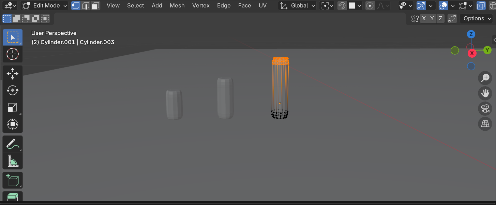

1. Створимо одну вигнуту - здублікуємо найбільший об'єкт
    
    

1. І додамо декілька розитинів через **Loop Cut and Slide**

    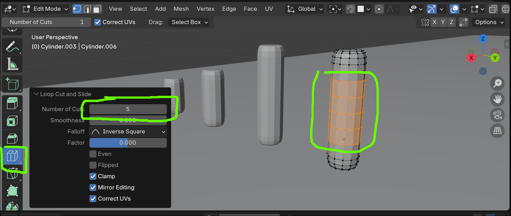

1. Тепер зігнемо об'єкт через модифікатор: **Deform**->**Simple Deform**.

      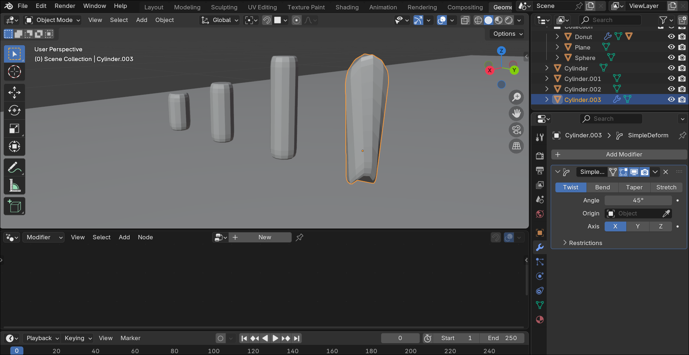

1. Змінимо деформацію на Bend(Згин)

    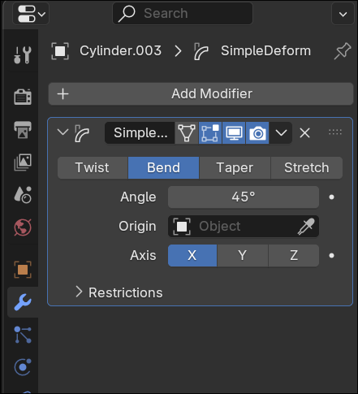

1. Є проблема - згин доволі дивний. Це через те що наша Origin точка(маленька жовта точка) не знаходиться поцентру об'єкту і ми не застосували наший Scale

    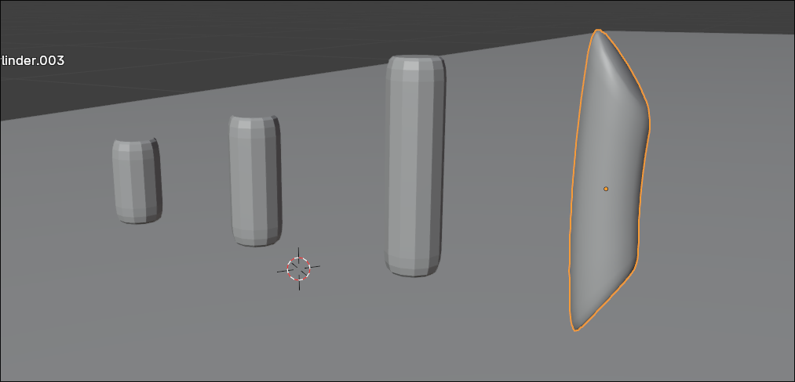

1. Виділяємо всі наші циліндри і застосовуємо **Scale** **[Ctrl+A]** -> Scale і змінюємо Origin
    
    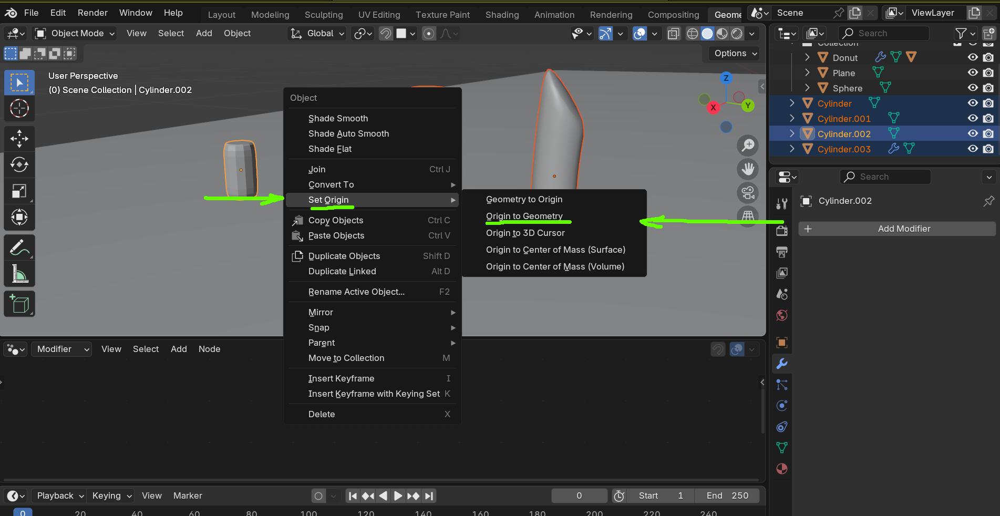

    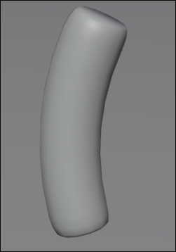

1. Застосуємо наш Bend в модифікаторах

    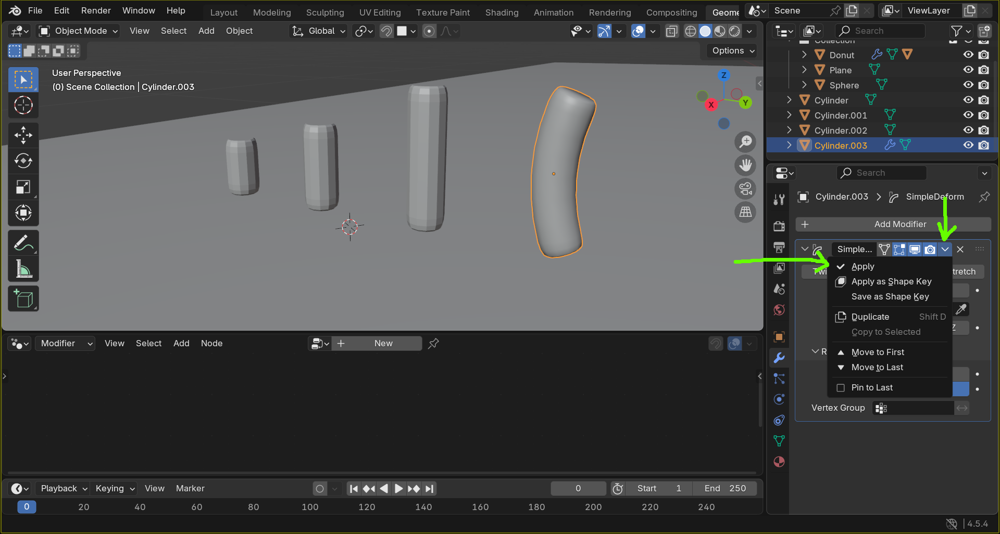

1. Виділяємо всі наші циліндрині об'єкти. Додамо їх в нову колекцію - **[M]** -> New Collection

    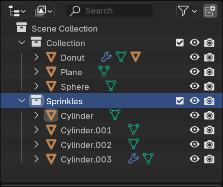

1. Дублікуємо наш бублик

    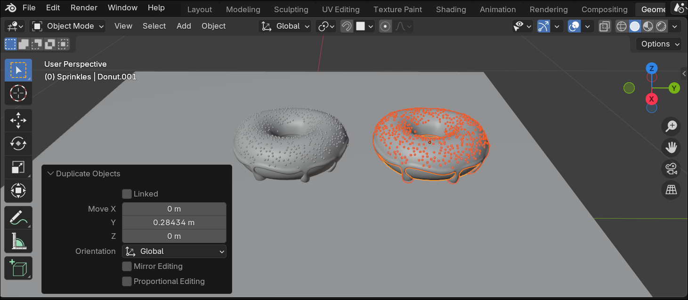

1. Тепер нам потрібно зробити генерацію роздільною. Виділяємо Glaze на другому пончику, переходимо в модифікатори і натискаємо на кнопку з **2**, 2 означає що на даний момент є два об'єкти що використовують саме цю генерацію

    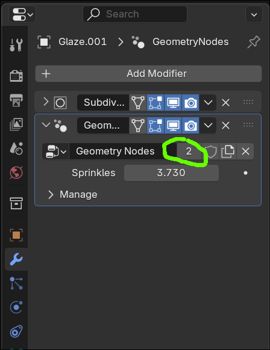

1. Перетягуємо колекцію Sprinkes з Outline в editor. Включаємо всі пташки на ноді. І підєднуємо до Instance to Point. Вмикаємно на Instance to Point - Pick Instance

    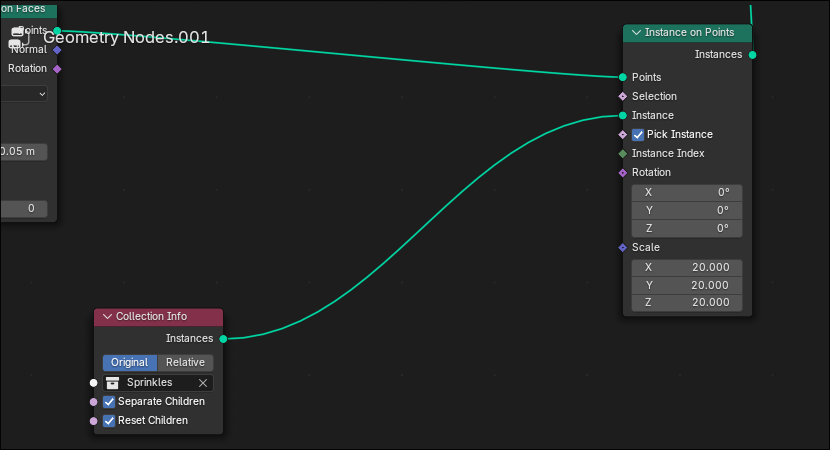

1. Проблема в тому що ми створили обєкти вертикальними, треба повернути їх. Додаємо ноду Rotate Instances і підключаємо її між Collection та Instance to Point. Робимо поворот по X - 90

    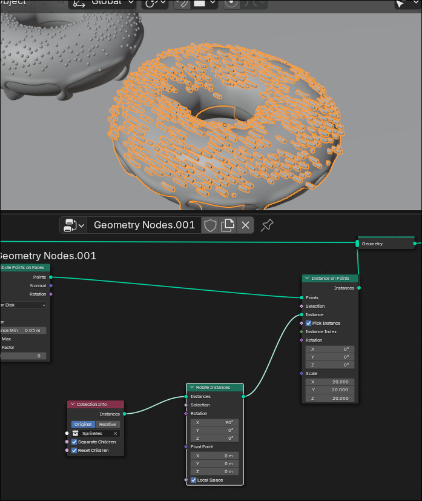

1. Тепер нам потрібно з'єднати наші точки на Glaze з оборотом Sprinkle

    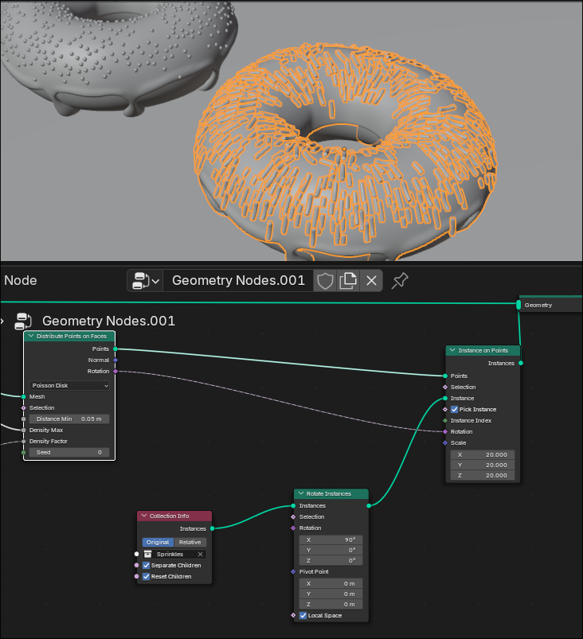

1. Додамо трохи випадковості до цього - додаємо Rotate Rotation. Вона повертає наші Sprinkes. Можете поекспериментувати зі значеннями
    
    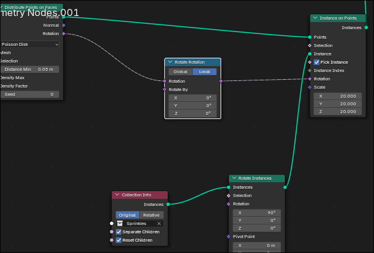

1. Додаємо Random Value і перемикаємо його в Vector

    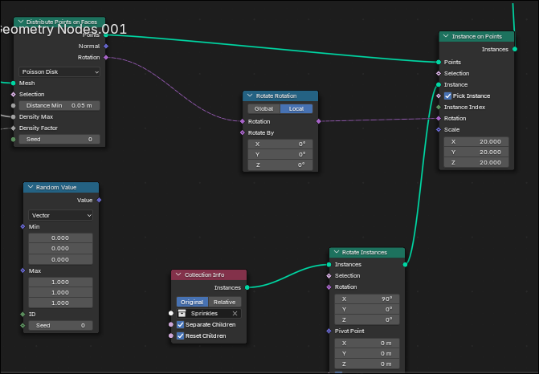

1. Додаємо Euler to Rotation і сполучаємо як на малюнку

    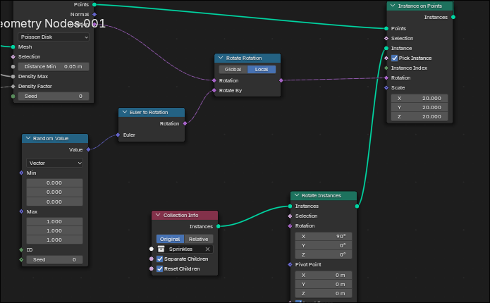

1. В Random Value змінюємо max Z Y на 6.283(якщо написати tau blender замінить заначення). min X: -0.5 max X: 0.5

    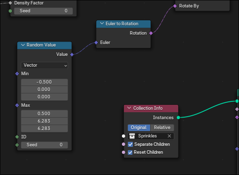

1. Фінальний результат

    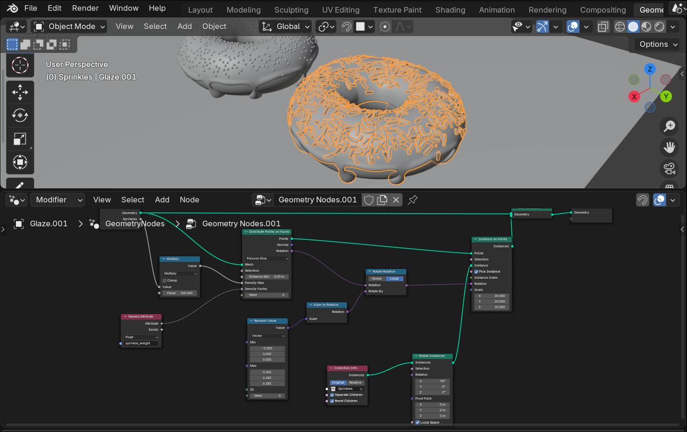