### Мета заняття
Будемо генерувати об'єкти програмно і додавати їх до моделі

### Виконання

1. Потрібно перейти на вкладку **Geometry Nodes**. Для цього наводимо курсор на верхню панель з іменами вкладок. Використовуємо колесико миші щоб знайти саму вкладку **Geometry Nodes**

    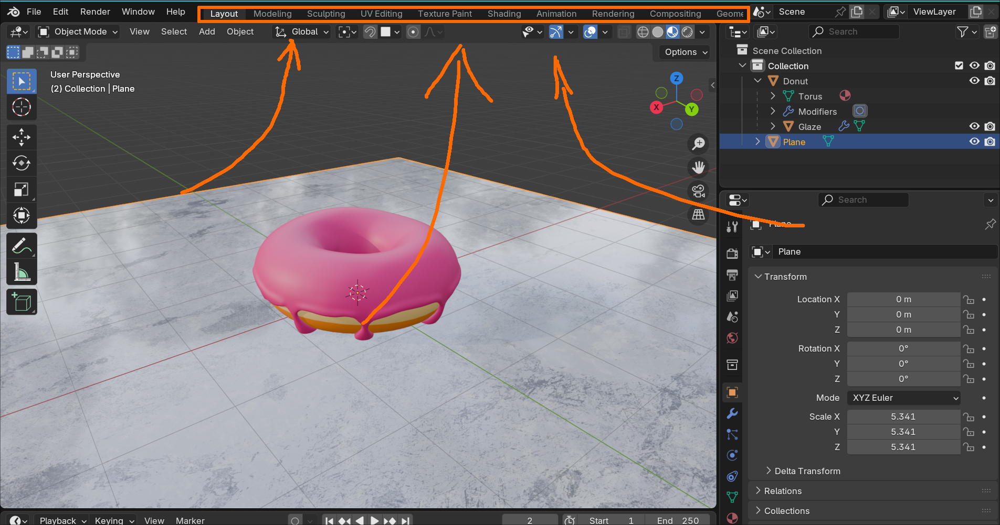

    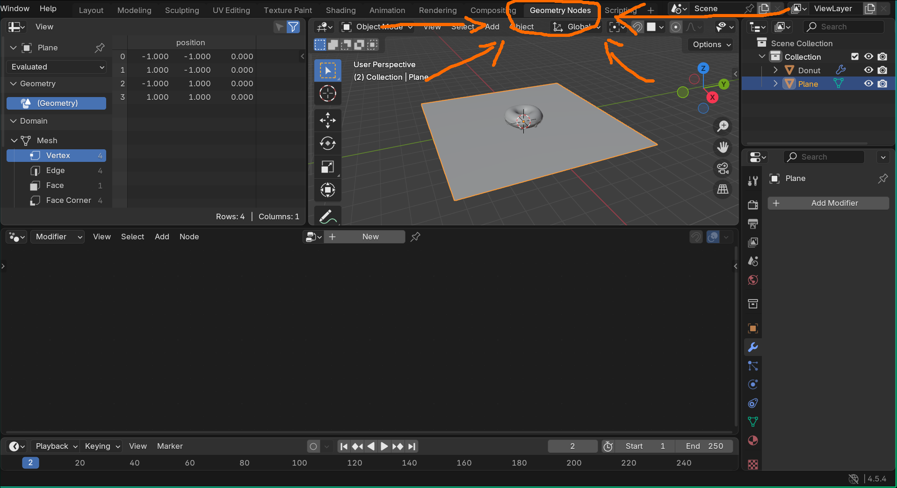

1.  Виділяємо в **Scene Collection** Glaze об'єкт і натискаємо **New**

    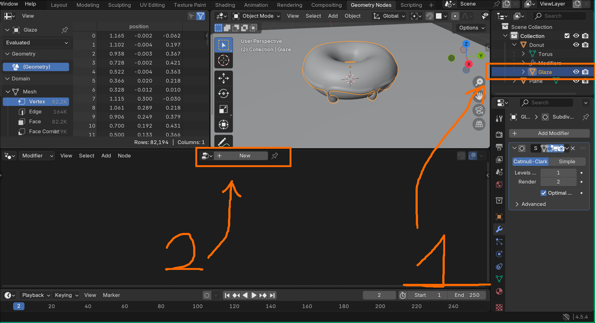

    Результат:

    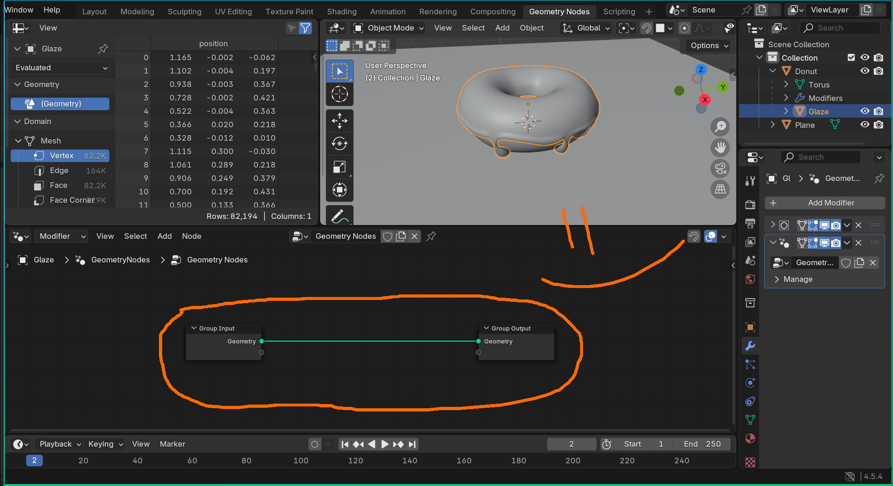

1. Для того щоб додати маленькі прикраси на пончик там для початку потрібно додати точки куди ми власне хочемо їх згенерувати. Наводимо в нашу робочу зону мишку(робоча зона це там де Group Input ---- Group Output) та натискаємо **[Shift-A]** знаходимо **Point** -> **Distribute Points on Faces** і вставляємо те що нам дає Blender між нодами

    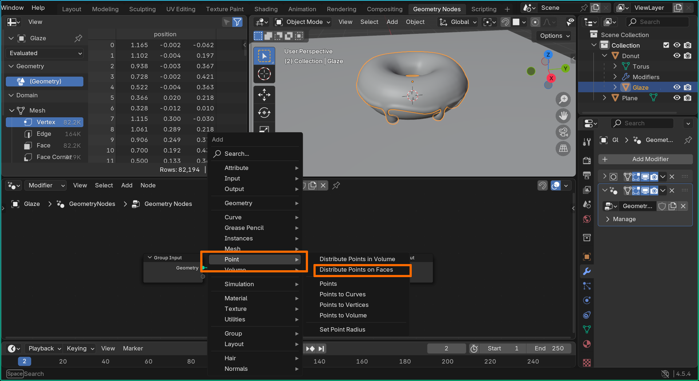

    Результат:

    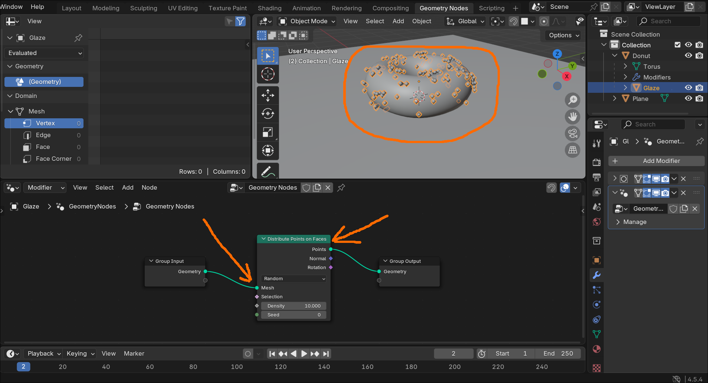

1. Наш верхній шар був замінений на точки. Щоб його повернути ми повинні додати ноду **Join Geometry** і зв'язати її з Input та Output

    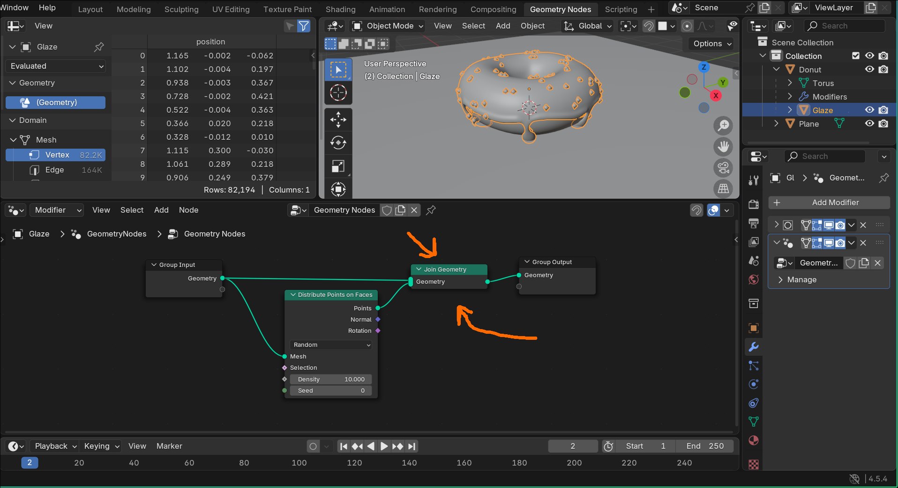

1. Додамо **[Shift+A]** новий **Mesh** об'єкт в нашу сцену. Використаємо сферу з невеликою кількістю граней.

    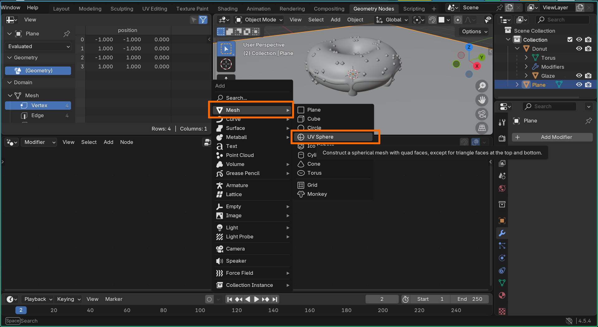

    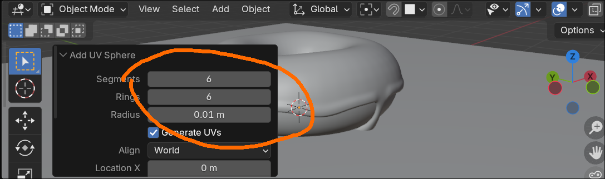

1. Перетягнемо обєкт зі сцени прямо в **Geometry Editor**

    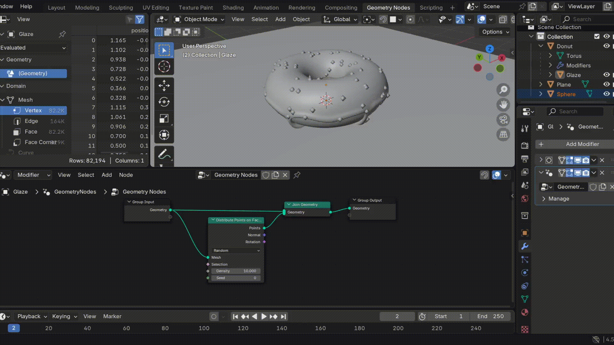

1. Створюємо нову ноду **Instances on Points**. Вона перетворює точки в об'єкти. І сполучаємо як на малюнкові.

    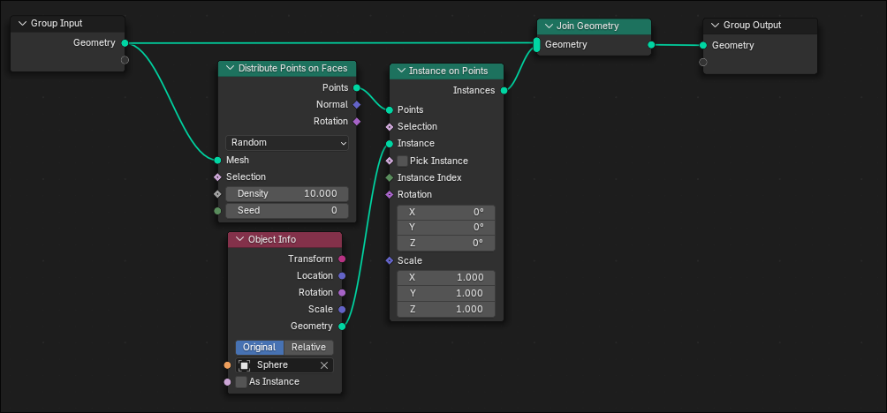

    На даному етапі вже можна поексперементувати з різними характеристиками, як от Density

    

1. Якщо збільшити Density надто сильно то наші точки почнуть накладатися. Щоб зменшити цей ефект ми зміними Random на Poisson Disk

    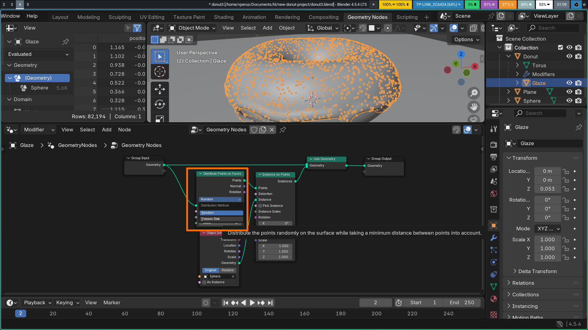

1. Підправимо властивості **Instances on Points**. Робимо на власний розсуд

    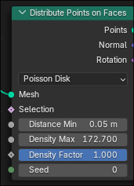

1. Наступна проблема полягає в тому що наші точки також знаходяться на стороні яка торкається бублика. Щоб поправити це перейдемо в **Weight Paint**

    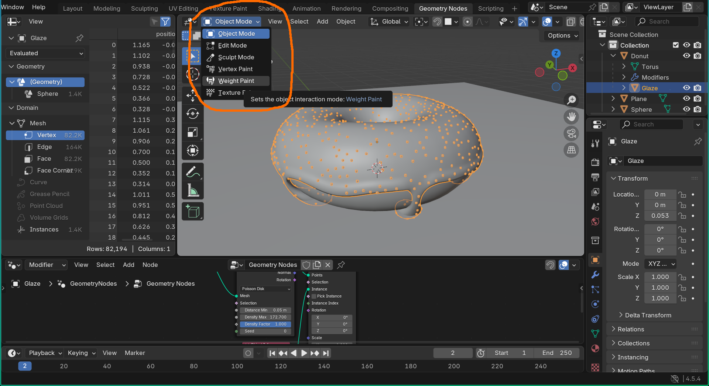

1. Довільно зафарбуємо верхню частину

    

1. Це зафарбування тепер доступне нам в бічній панелі **Data**. Перейдемо і перейменуємо його в **sprinkle_weight**

    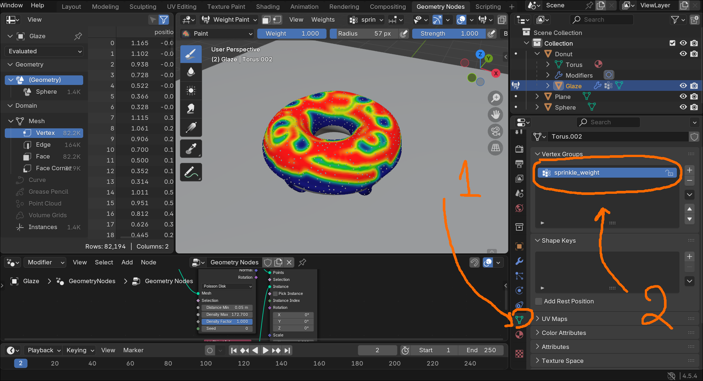

1. Додаємо в **Geometry Editor** нову ноду **Named Attribute** імя заміняємо на **sprinkle_weight** і з'єднуємо **Attribute** з **Density Factor**

    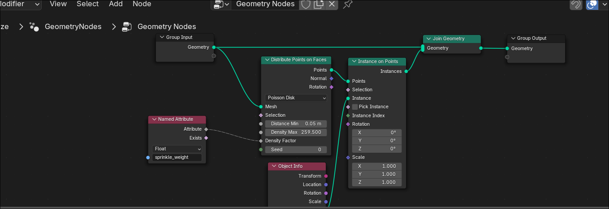

1. Виділяємо **Sphere** в сцені і включаємо для неї **Shade Smooth**(права кнопка миші, в контекстному меню)

1. Витягнемо для зручності **Density Max** як параметер, для цього затискаємо його і перетягуємо до **Group Input**. Натискаємо **[N]** та перейменовуємо **Density Max** на **Sprinkles**

    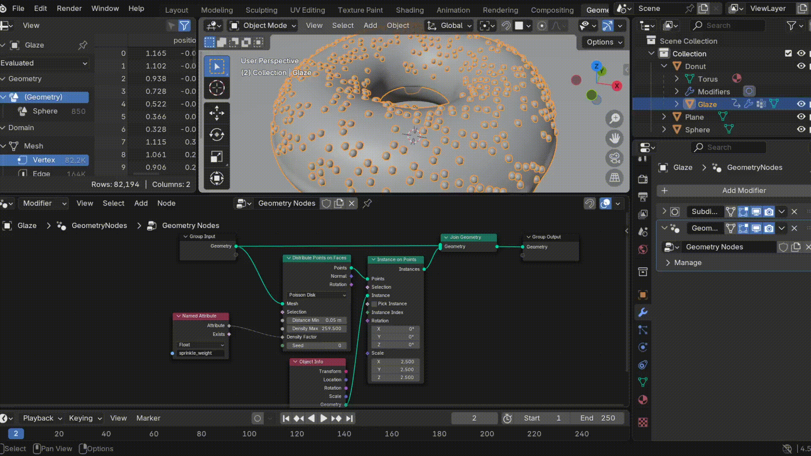

    Нам потрібно підправити розміри нашого бублика. На данний момент він у нас 2м

    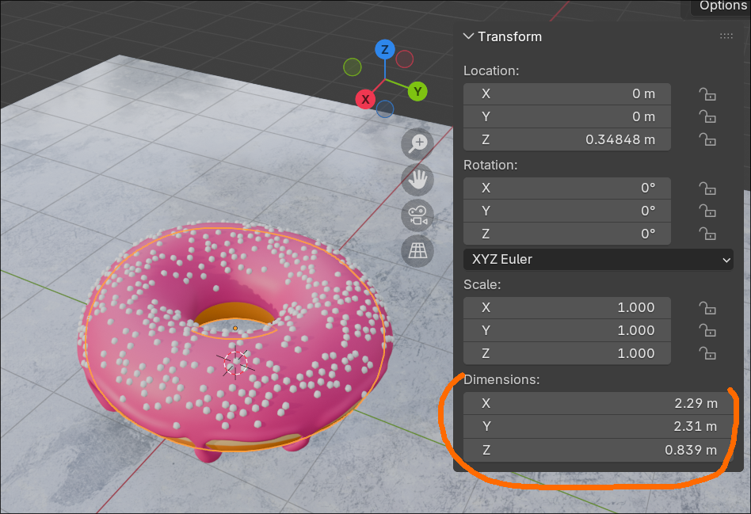

1. Переходимо в **Object Mode** Виділяємо Donut, Plane, Sphere(Ctrl+mouse click). Натискаємо **[S]** і вводимо на клавіатурі **.1** + **[Enter]**

    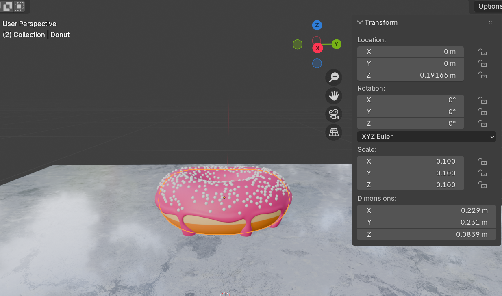

1. Ці зміни потрібно застовувати ще однією дією **[Сtrl+A]** + **Scale**

    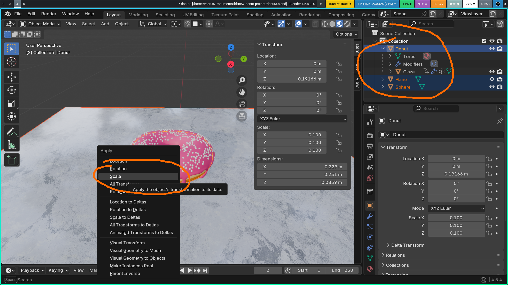

1. Остання дія матиме сильний ефект на наші прикраси. Потрібно підправити це змінивши **Sprinkles** в модифікаторах **Glaze**

1. Додамо ще одну ноду - **Math** змінимо дію на множенні - **Multiply** і підєднаємо до **Density Max**, Value виставимо на 100. Це для зручності, щоб маленькі зміни Sprinkles призводили до значних змін кількості

    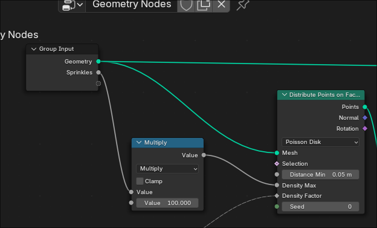