### Мета заняття
Навчитися додавати текстури

### Виконання
1. Відкрити проектний файл **donut.blend** з яким ми працювали попереднього разу

1. В **Outline** панелі обрати **Glaze**

    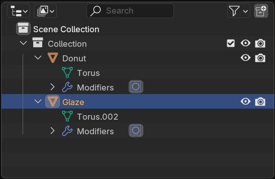

1. Перемкнутися в панелі властивостей на **Material** додати новий матеріал 

    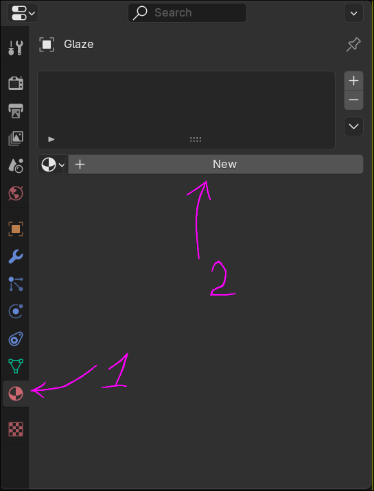

1. Виберіть новий колір для Glaze змінивши **Base Color**

    

1. Виконайте заміну кольору і для об'єкту **Donut**

    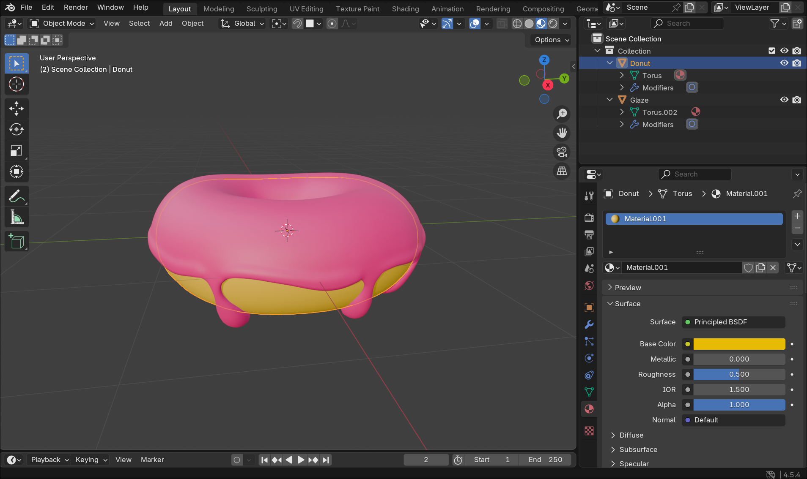

1. Додати площину до сцени **[Shift + A]** (Mesh -> Plane)

    

1. Відмаштабувати площину зробивши її більшою **[S + Mouse]**

    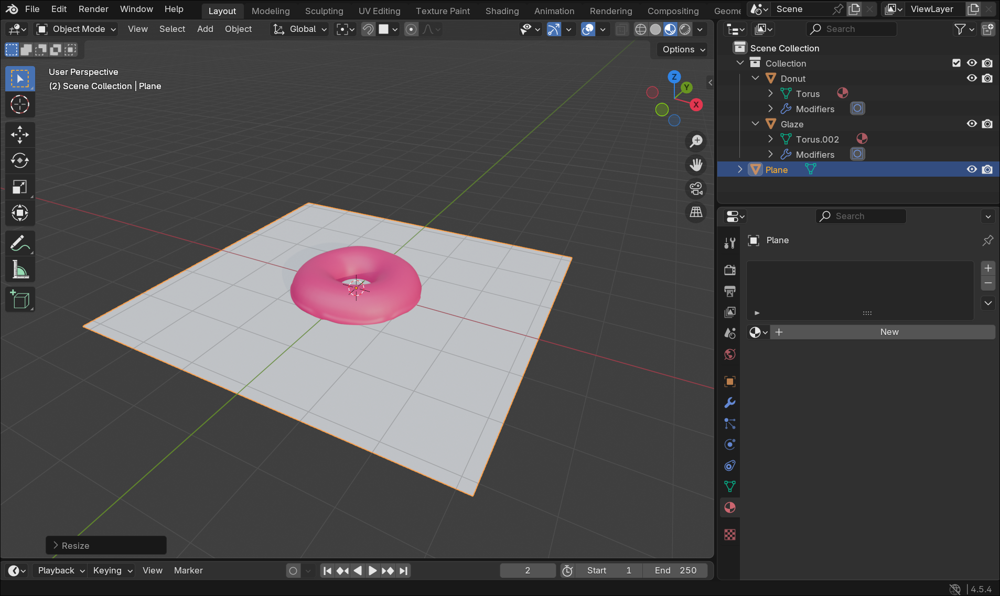

1. Для зручності роботи з об'єктами потрібно згрупувати **Donut** та **Glaze** разом. Для цього в **Outline** потрібно виділити **Donut**, затиснувши **[Shift]** клікнути на **Glaze** та не знімаючи виділення натиснути комбінацію **[Ctrl + P]**. Результат повинен виглядати як на картинці

    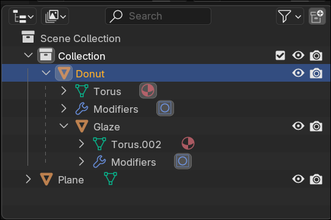

1. Виділити **Donut** і перетягнути його по Z осі так щоб він знаходився на площині

    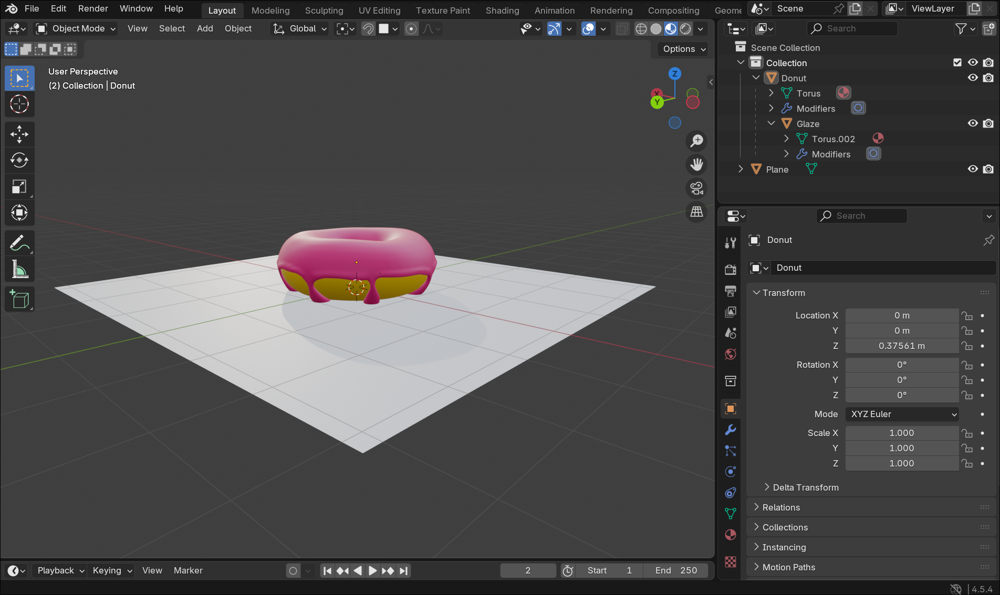

1. Скачати з онлайн ресурсу текстуру мармуру - [посилання](https://ambientcg.com/view?id=Marble012). Розархівувати все.

    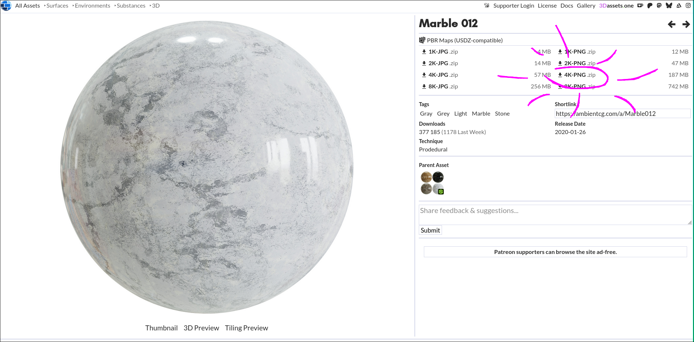

1. Перемикаємося на вкладку **Shading**

    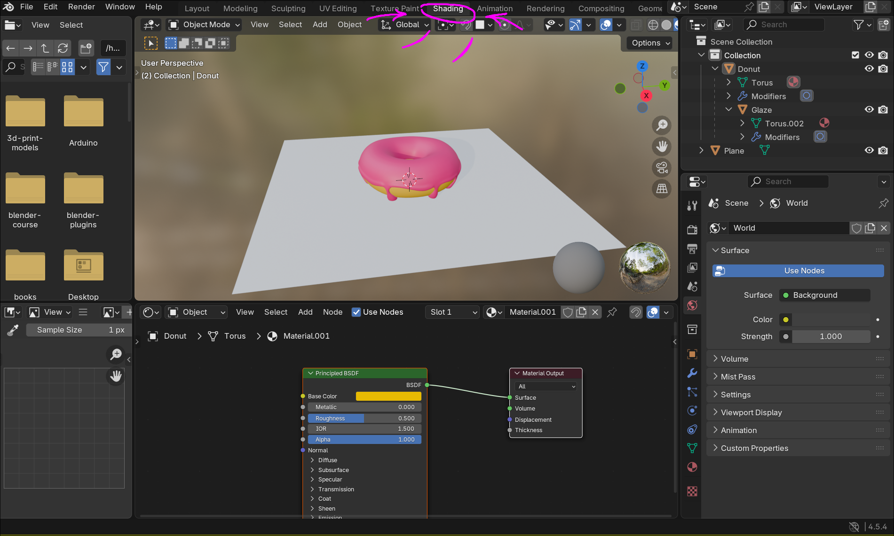

1. В **Outline** виділяємо Plane та натискаємо **+ New** кнопку в редакторі шейдера

    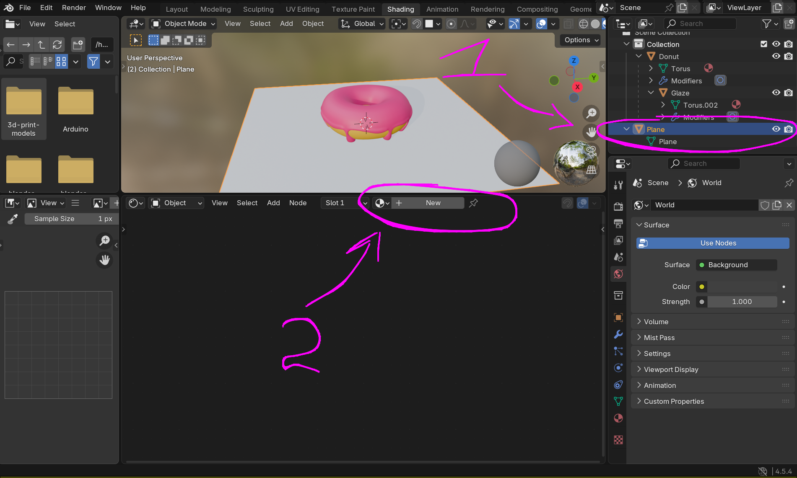

1. Тепер під'єднаємо текстури до шейдера. Якщо затиснути кнопку миші і відтягнути кружечок(на прямокутниках з правої сторони) то у нас з'явиться контестне меню в якому ми зможемо обрати **Image Texture**

    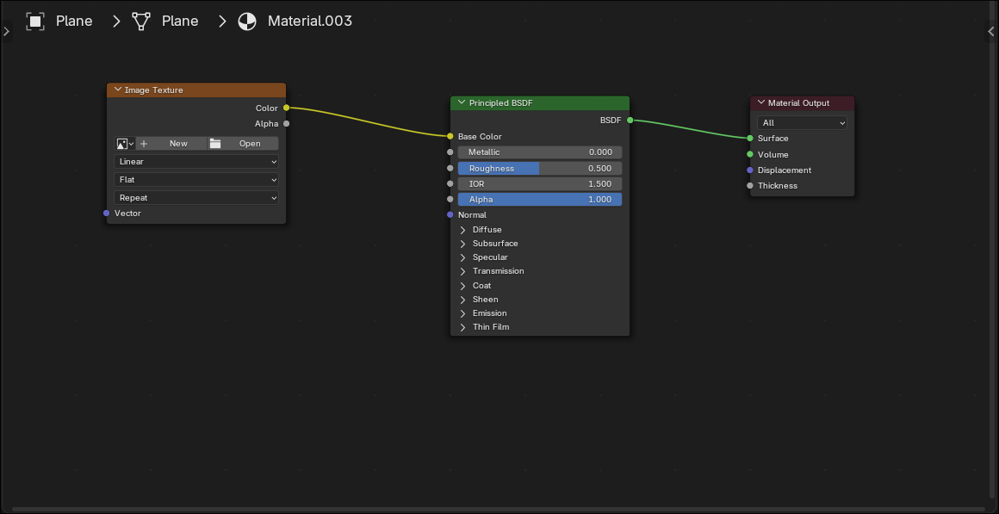

1. Модифікуємо новий блок який ми додали - натискаємо **Open** і знаходимо в видобутому архіві - **Marble012_4K-PNG_Color.png** 

    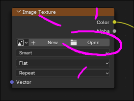

1. Додаємо ще блоки для Roughness Normal і підключаємо відповідні файли. Повинно вийти так як на малюнку.

    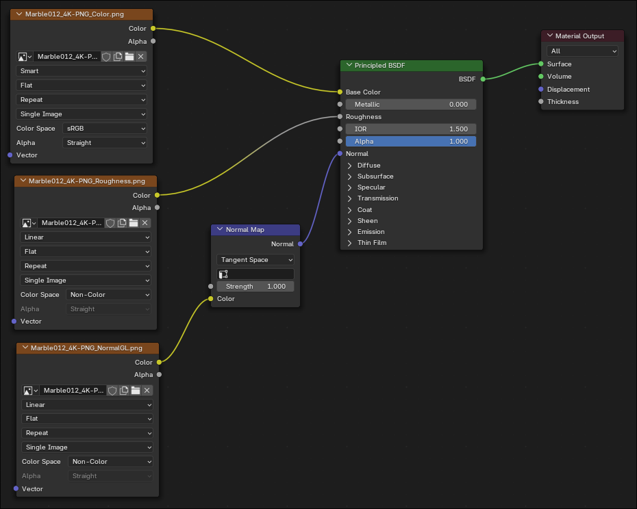

1. Перемкніть **Color Space** в **Non-Color** для Roughness та NormalGL

    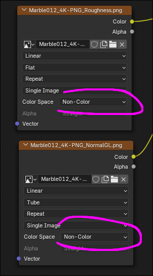

1. Змінемо текстуру самого бублика додавши трохи деталей. В **Properties** знову переходимо на Material і знаходимо **Base Color**. Клікаємо на цяточку біля і обираємо **Image Texture**. Натискаємо на **New**

    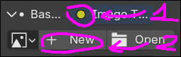

1. В меню змінюємо Name на Base та Color на оранжевий

1. Переключитися на "Texture Paint", змінити колір пензля на білий

    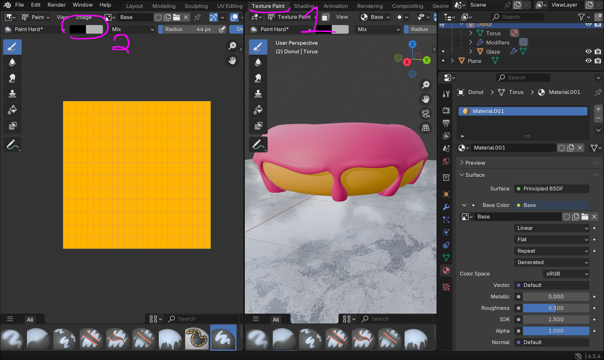

1. Провести пензликом по текстурі

    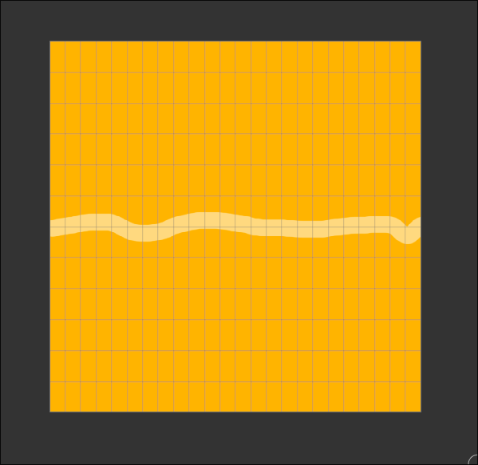

1. Зберегти текстуру **Image** -> **Save**

    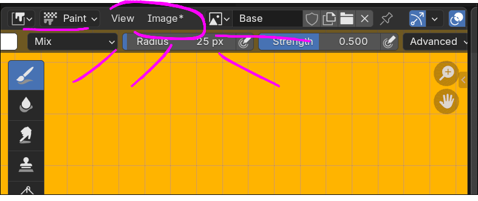

### Результат
Зберегти все. Обов'язково зберегти текстуру бублика(ту яку малювали вручну)